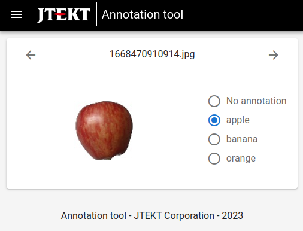

# Annotation tool

This is a tool to annotate image datasets, mainly intended to be used in AI applications.
It allows each images to be annotated with a label picked from predefined list.
Here, images are to be stored and managed by the Image Storage Service, developed by JTEKT.

<p align="center">
  
</p>

## Usage

This application is intended to be run as a docker container. For example:

```
docker run \
-e VUE_APP_IMAGE_STORAGE_API_URL=http://192.168.1.2:7070 \
-e VUE_APP_LABELS=cat,dog \
public.ecr.aws/jtekt-corporation/annotation-tool
```

## Environment variables

Here is a list of the available options:

| Variable                      | Description                                      |
| ----------------------------- | ------------------------------------------------ |
| VUE_APP_IMAGE_STORAGE_API_URL | The URL of Image Storage Service API             |
| VUE_APP_LABELS                | Comma-separated list of labels (optional)        |
| VUE_APP_IDENTIFICATION_URL    | URL of the user identification system (optional) |
| VUE_APP_LOGIN_URL             | URL of the user login system (optional)          |

Note: Authentication is enforced if both VUE_APP_IDENTIFICATION_URL and VUE_APP_LOGIN_URL are set
